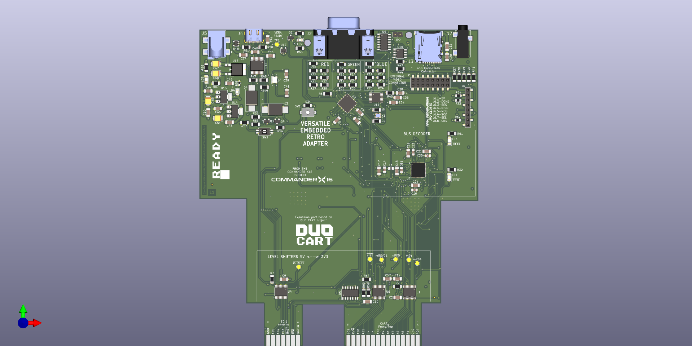
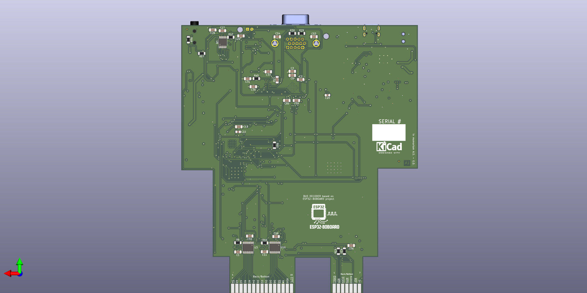
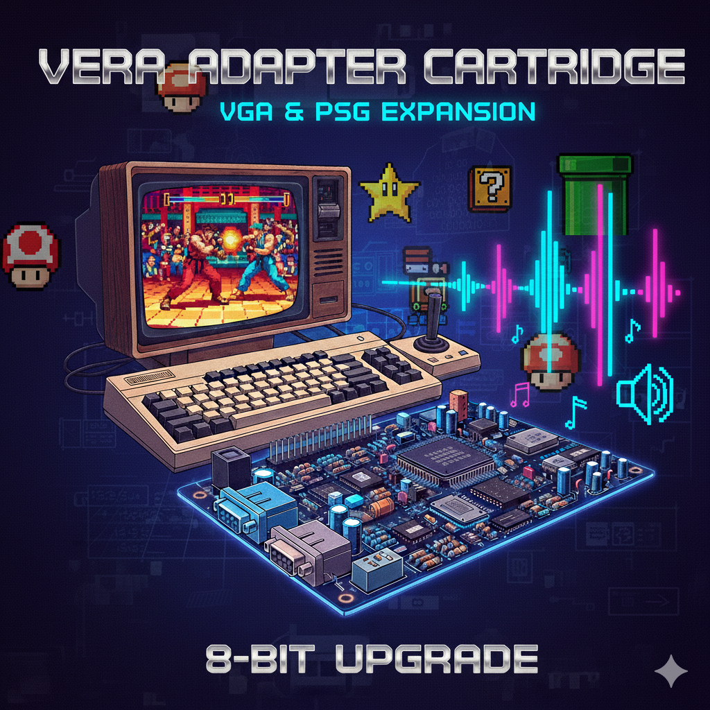
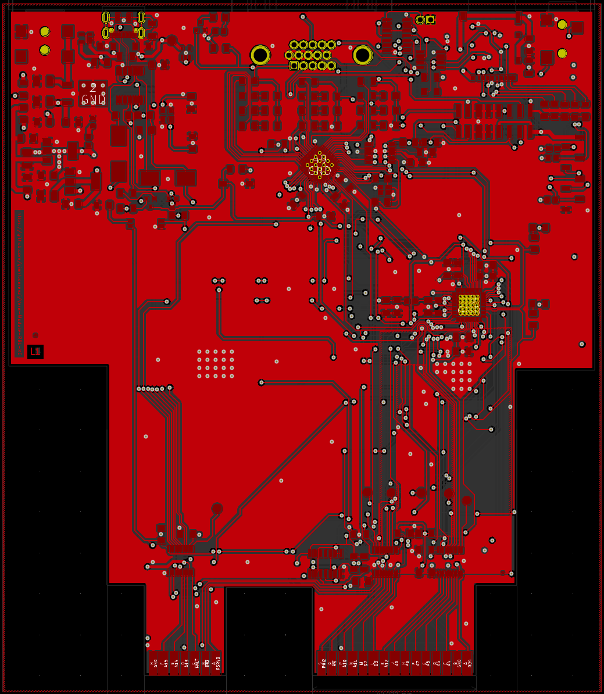
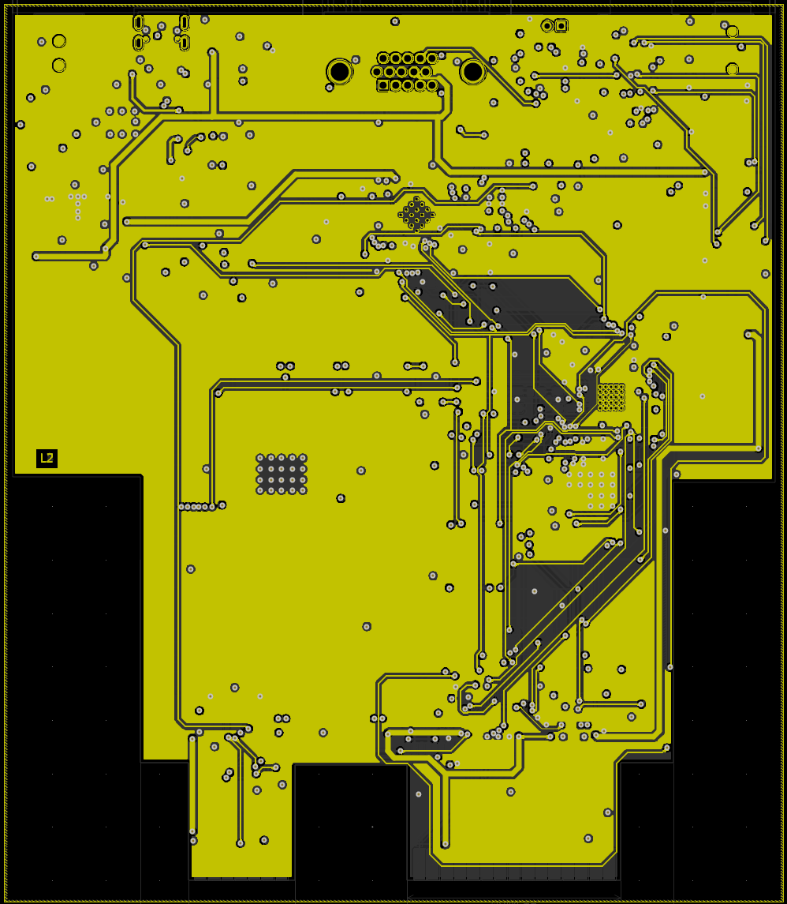
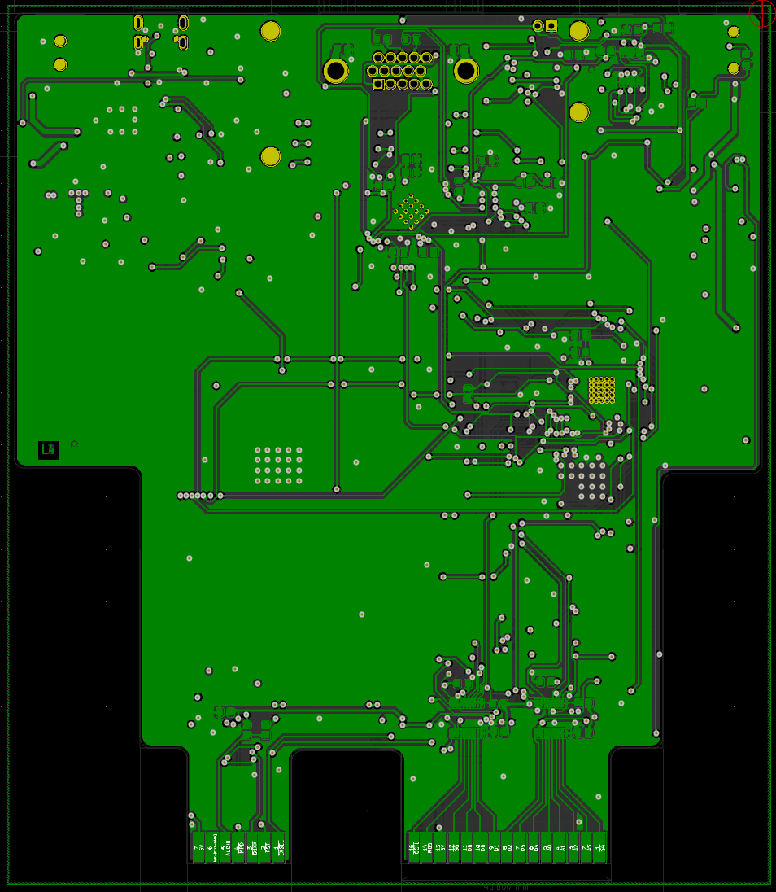

# VERA Module RBL-XE

<div align="center">

[](https://www.gnu.org/licenses/gpl-3.0)
[](https://www.kicad.org/)
[](https://atari.com)
[](https://www.espressif.com/)

*🌐 English | [🌐 Italiano](#vera-module-rbl-xe-italiano)*

</div>

---

<div style="background: #ffffff; border-radius: 16px; padding: 24px; margin: 24px 0; box-shadow: 0 4px 12px rgba(0,0,0,0.1); border: 1px solid #e0e0e0;">

## 📋 Table of Contents

- [🔍 Overview](#-overview)
- [✨ Features](#-features)
- [⚙️ Technical Specifications](#️-technical-specifications)
- [🔧 Hardware Components](#-hardware-components)
- [🖼️ Board Preview](#️-board-preview)
- [📐 PCB Layers](#-pcb-layers)
- [🔌 Connectors & Interfaces](#-connectors--interfaces)
- [⚡ Power Requirements](#-power-requirements)
- [🔨 Assembly Instructions](#-assembly-instructions)
- [📦 Bill of Materials](#-bill-of-materials)
- [💻 Programming & Configuration](#-programming--configuration)
- [📁 Project Structure](#-project-structure)
- [🤝 Contributing](#-contributing)
- [📄 License](#-license)

</div>

---

<div style="background: #ffffff; border-radius: 16px; padding: 24px; margin: 24px 0; box-shadow: 0 4px 12px rgba(0,0,0,0.1); border: 1px solid #e0e0e0;">

## 🔍 Overview

The **VERA Module RBL-XE** is a sophisticated FPGA-based audio and video 
expansion card designed specifically for **ATARI XE** computers. 
This module brings modern graphics and audio capabilities to classic ATARI systems 
through the **PBI (Parallel Bus Interface)** protocol connectors.

### What is VERA?

**VERA** (Video Enhanced Retro Adapter) is originally designed for the 
Commander X16 computer but has been adapted for ATARI systems. It provides:

- **Advanced Graphics**: Multiple video layers, sprites, and high-resolution modes
- **Enhanced Audio**: Multi-channel digital audio with PCM and PSG capabilities  
- **Modern Connectivity**: VGA output, SD card storage, and USB programming
- **Retro Compatibility**: Integration with ATARI software with simple drivers

</div>

---

<div style="background: #ffffff; border-radius: 16px; padding: 24px; margin: 24px 0; box-shadow: 0 4px 12px rgba(0,0,0,0.1); border: 1px solid #e0e0e0;">

## ✨ Features

### 🎨 Graphics Capabilities

#### Video Output
- **VGA Output**: 640x480 @ 60Hz with analog RGB signals
- **Multiple Layers**: Background, foreground, and sprite layers
- **Color Depth**: 256 colors from a palette of 4096
- **Sprites**: Hardware-accelerated sprite engine
- **Scrolling**: Smooth horizontal and vertical scrolling

#### Audio Features
- **Digital Audio**: High-quality PCM audio output
- **Multi-channel**: Stereo audio
- **Audio Codec**: WM8524 for professional audio quality
- **3.5mm Jack**: Standard audio output connector

### 🔗 System Integration

#### ATARI Compatibility
- **PBI Interface**: Direct connection to ATARI XE systems
- **Memory Mapping**: $D1XX-$DFXX address space
- **Bus Decoder**: Intelligent address decoding with ESP32
- **Power Management**: Efficient 5V to 3.3V/1.2V conversion

#### Storage & Programming
- **SD Card Slot**: Micro SD for data storage and ROM loading
- **SPI Flash**: 16Mbit W25Q16 for FPGA configuration
- **USB Programming**: CH340 USB-to-serial for easy updates
- **JTAG/SPI**: Direct FPGA programming interface

</div>

---

<div style="background: #ffffff; border-radius: 16px; padding: 24px; margin: 24px 0; box-shadow: 0 4px 12px rgba(0,0,0,0.1); border: 1px solid #e0e0e0;">

## ⚙️ Technical Specifications

### Core Specifications

| Component | Specification |
|-----------|---------------|
| **FPGA** | Lattice ICE40UP5K-SG48ITR |
| **Microcontroller** | ESP32-PICO-D4 |
| **Flash Memory** | W25Q16JVSNIQ (16Mbit) |
| **Audio Codec** | WM8524CGEDT |
| **USB Interface** | CH340T |
| **Power Regulators** | AMS1117-3.3V, AMS1117-1.2V, L7805 |
| **Crystal Oscillator** | 25MHz ECS-2033-250-BN |
| **PCB Layers** | 4-layer (Signal/Power/GND/Signal) |
| **Board Size** | TBD mm x TBD mm |

### Electrical Characteristics

| Parameter | Min | Typ | Max | Unit |
|-----------|-----|-----|-----|------|
| **Supply Voltage** | 4.5 | 5.0 | 5.5 | V |
| **Current Consumption** | - | 800 | 1200 | mA |
| **Operating Temperature** | -10 | 25 | 70 | °C |
| **VGA Output Impedance** | - | 75 | - | Ω |
| **Audio Output Level** | - | 2.0 | - | Vrms |

</div>

---

<div style="background: #ffffff; border-radius: 16px; padding: 24px; margin: 24px 0; box-shadow: 0 4px 12px rgba(0,0,0,0.1); border: 1px solid #e0e0e0;">

## 🔧 Hardware Components

### Main Processing Units

#### FPGA - ICE40UP5K
- **Logic Elements**: 5,280 LUTs
- **Memory**: 120 Kbit BRAM, 1 Mbit SPRAM
- **I/O Pins**: 39 user I/O
- **Package**: QFN-48 (7x7mm)
- **Programming**: SPI configuration

#### ESP32-PICO-D4
- **CPU**: Dual-core Xtensa LX6 @ 240MHz
- **Memory**: 4MB SPI flash, 520KB SRAM
- **Connectivity**: Wi-Fi 802.11 b/g/n, Bluetooth 4.2
- **Package**: QFN-48 (7x7mm)
- **Role**: Bus decoder and system controller

### Interface Components

#### Audio System
- **Codec**: WM8524CGEDT (24-bit, 192kHz)
- **Interface**: From FPGA digital audio bus
- **Output**: 3.5mm stereo jack
- **SNR**: >100dB

#### Video System
- **Output**: 15-pin VGA connector
- **Resolution**: 640x480 @ 60Hz
- **Colors**: 8-bit RGB (256 colors)
- **Sync**: Separate H/V sync signals

</div>

---

<div style="background: #ffffff; border-radius: 16px; padding: 24px; margin: 24px 0; box-shadow: 0 4px 12px rgba(0,0,0,0.1); border: 1px solid #e0e0e0;">

## 🖼️ Board Preview

### 3D Renderings

#### Top View

*Top side showing main components and connectors*

#### Bottom View  

*Bottom side with additional components*

#### Cartridge Adapter

*Optional cartridge interface adapter*

### Board Dimensions

- **Length**: TBD mm
- **Width**: TBD mm  
- **Thickness**: 1.6mm (4-layer PCB)
- **Mounting**: Compatible with ATARI XE CART + ECI slots
- **Connectors**: Flat for space efficiency. It needs a custom 3D printed case

</div>

---

<div style="background: #ffffff; border-radius: 16px; padding: 24px; margin: 24px 0; box-shadow: 0 4px 12px rgba(0,0,0,0.1); border: 1px solid #e0e0e0;">

## 📐 PCB Layers

### Layer Stack-up

#### Layer 1 - Top Copper (F.Cu)

*Component placement and signal routing*

#### Layer 2 - Power Plane (POWER)

*5V, 3.3V, and 1.2V power distribution*

#### Layer 3 - Ground Plane (GND)

*Solid ground plane for signal integrity*

#### Layer 4 - Bottom Copper (B.Cu)

*Additional signal routing and components*

</div>

---

<div style="background: #ffffff; border-radius: 16px; padding: 24px; margin: 24px 0; box-shadow: 0 4px 12px rgba(0,0,0,0.1); border: 1px solid #e0e0e0;">

## 🔌 Connectors & Interfaces

### External Connections

#### ATARI XE Interface
- **Cartridge Connector**: Classic Cartridge Edge Connector 30 pin 
- **ECI Slot**: Enhanced Cartridge Interface 14 pin 
- **Address Range**: $D1XX-$DFXX
- **Signals**: Data bus, address bus, control signals

#### Video Output (J2)
| Pin | Signal | Description |
|-----|--------|-------------|
| 1-3 | RGB | Red, Green, Blue analog signals |
| 13-14 | H/V Sync | Horizontal/Vertical sync |
| 6-10 | GND | Ground connections |
| 11-12 | Audio L/R | Stereo audio output |

#### Storage Interfaces
- **SD Card Slot (J3)**: Micro SD card interface
- **SPI Flash**: On-board 16Mbit storage
- **USB Port (J4)**: Programming and data transfer

### Programming Interfaces

#### ICEPROG Connector (J6)
| Pin | Signal | Function |
|-----|--------|----------|
| 1 | 5V | Power supply |
| 2 | FPGA_CDONE/PULL-UP | FPGA Programmed |
| 3 | FPGA_RESET | FPGA Reset |
| 4 | MISO | SPI data in |
| 5 | MOSI | SPI data out |
| 6 | SCK | SPI clock |
| 7 | SS | SPI select |
| 8 | GND | Ground |

#### Reset & Control
- **Reset Button (SW1)**: ESP32 system reset
- **DIP Switch (SW2)**: Configuration options
- **Status LEDs**: Power, programming, activity indicators

</div>

---

<div style="background: #ffffff; border-radius: 16px; padding: 24px; margin: 24px 0; box-shadow: 0 4px 12px rgba(0,0,0,0.1); border: 1px solid #e0e0e0;">

## ⚡ Power Requirements

### Power Distribution

#### Power Rails
| Rail | Voltage | Current | Components |
|------|---------|---------|------------|
| **5V** | 5.0V ± 5% | 200mA | Input from ATARI, USB |
| **3.3V** | 3.3V ± 3% | 400mA | ESP32, logic, interfaces |
| **1.2V** | 1.2V ± 3% | 300mA | FPGA core voltage |

#### Power Sources
1. **ATARI PBI**: Primary 5V supply from computer
2. **USB**: Alternative 5V for programming/testing
3. **External**: Optional external 5V supply (J5)

#### Power Protection
- **Schottky Diodes**: Reverse polarity protection
- **Ferrite Beads**: EMI filtering
- **Decoupling**: Extensive capacitor network
- **Current Limiting**: Overcurrent protection

</div>

---

<div style="background: #ffffff; border-radius: 16px; padding: 24px; margin: 24px 0; box-shadow: 0 4px 12px rgba(0,0,0,0.1); border: 1px solid #e0e0e0;">

## 🔨 Assembly Instructions

### Component Assembly

#### Assembly Order
1. **SMD Components**: Start with smallest components (0603, 0805)
2. **ICs**: Place all integrated circuits
3. **Connectors**: Install all external connectors
4. **Through-hole**: Add any remaining THT components
5. **Testing**: Verify power rails before first power-on

#### Special Considerations
- **FPGA**: Use proper ESD precautions
- **BGA Components**: Requires professional assembly
- **Thermal Management**: Ensure adequate cooling
- **Impedance Control**: Maintain 50Ω for high-speed signals

### Testing & Validation

#### Power-On Tests
1. **Visual Inspection**: Check for shorts, proper orientation
2. **Power Rails**: Verify all voltages within tolerance
3. **Clock Signals**: Confirm oscillator operation
4. **Communication**: Test SPI, I2C, UART interfaces

#### Functional Tests
1. **FPGA Programming**: Load test bitstream
2. **Video Output**: Verify VGA signal generation
3. **Audio Output**: Test audio codec functionality
4. **ATARI Interface**: Confirm PBI communication protocol

</div>

---

<div style="background: #ffffff; border-radius: 16px; padding: 24px; margin: 24px 0; box-shadow: 0 4px 12px rgba(0,0,0,0.1); border: 1px solid #e0e0e0;">

## 📦 Bill of Materials

### Component Categories

#### Major Components
- **1x** ICE40UP5K-SG48ITR FPGA
- **1x** ESP32-PICO-D4 Microcontroller  
- **1x** W25Q16JVSNIQ SPI Flash
- **1x** WM8524CGEDT Audio Codec
- **1x** CH340T USB Interface

#### Passive Components
- **23x** 1µF Capacitors (1206)
- **20x** 100nF Capacitors (1206)
- **6x** 10µF Capacitors (1206)
- **Various** Resistors (0805/1206)
- **1x** 25MHz Crystal Oscillator

#### Connectors
- **1x** 15-pin VGA Connector
- **1x** Micro SD Card Slot
- **1x** USB Type-C Connector
- **1x** 3.5mm Audio Jack
- **1x** 8-pin Programming Header

### Cost Analysis

| Category | Estimated Cost | Percentage |
|----------|----------------|------------|
| **FPGA** | $15-20 | 35% |
| **ESP32** | $8-12 | 20% |
| **Connectors** | $5-8 | 15% |
| **Passives** | $3-5 | 10% |
| **PCB** | $8-12 | 20% |
| **Total** | **$39-57** | **100%** |

*Costs are estimates for small quantity production*

</div>

---

<div style="background: #ffffff; border-radius: 16px; padding: 24px; margin: 24px 0; box-shadow: 0 4px 12px rgba(0,0,0,0.1); border: 1px solid #e0e0e0;">

## 💻 Programming & Configuration

### FPGA Programming

#### Programming Methods
1. **USB/Serial**: Using FTDI 232H adapter interface with iceprog
2. **SPI Direct**: Direct SPI flash programming
3. **JTAG**: Hardware debugging interface

#### Programming Steps
```bash
# Install icestorm toolchain
sudo apt install fpga-icestorm

# Program FPGA via USB (The FPGA bitstream is not provided!)
iceprog vera_module.bin

# Verify programming
iceprog -c
```

#### Development Tools
- **IceStorm**: Open-source FPGA toolchain
- **Yosys**: Verilog synthesis
- **NextPNR**: Place and route
- **KiCad**: PCB design and layout

### ESP32 Configuration

#### ESP32 Firmware
The ESP32 handles:
- **Bus Decoding**: ATARI address space management
- **Configuration**: FPGA and system setup
- **Communication**: USB CH340 interface
- **Debugging**: System monitoring and diagnostics

#### Programming ESP32
```bash
# Install ESP-IDF
git clone https://github.com/espressif/esp-idf.git
cd esp-idf && ./install.sh

# Build and flash firmware
idf.py build
idf.py flash
```

</div>

---

<div style="background: #ffffff; border-radius: 16px; padding: 24px; margin: 24px 0; box-shadow: 0 4px 12px rgba(0,0,0,0.1); border: 1px solid #e0e0e0;">

## 📁 Project Structure

### Repository Organization

```
Vera-Module-RBL-XE/
├── 📄 README.md                    # This documentation
├── 📄 LICENSE                      # GPL v3 license
├── ⚙️ VERA-MODULE-RBL.pro         # KiCad project file
├── 📄 VERA-MODULE-RBL.sch         # Main schematic
├── 🔧 VERA-MODULE-RBL.kicad_pcb   # PCB layout
├── 📄 VERA-MODULE-RBL.csv         # Bill of materials
├── 🐍 jlcpcb-check-bom.py        # BOM processing script
├── 📁 images/                      # Board images and renders
│   ├── 🖼️ VERA-MODULE-RBL-TOP.png
│   ├── 🖼️ VERA-MODULE-RBL-BOTTOM.png
│   ├── 🖼️ F.Cu-L1.png            # PCB layer images
│   ├── 🖼️ POWER-L2.png
│   ├── 🖼️ GND-L3.png
│   └── 🖼️ B.Cu-L4.png
├── 📁 production/                  # Manufacturing files
│   ├── 📄 *.gbl, *.gtl            # Gerber files
│   ├── 📄 *.drl                   # Drill files
│   └── 📄 *.gbrjob                # Job files
├── 📁 ibom/                       # Interactive BOM
│   └── 🌐 ibom.html
└── 📁 schematics/                 # Individual schematics
    ├── 📄 vera-fpga.sch           # FPGA module
    ├── 📄 busdecoder.sch          # Bus decoder
    ├── 📄 cartridgeInterface.sch   # Cartridge interface
    ├── 📄 vera-fpga-flash.sch     # Flash memory
    └── 📄 powersupply.sch         # Power management
```

### Design Files

#### KiCad Files
- **Schematic**: Multi-sheet hierarchical design
- **PCB Layout**: 4-layer board with controlled impedance
- **3D Models**: Custom component models
- **Footprints**: Custom connector footprints

#### Manufacturing Files
- **Gerber Files**: Industry-standard PCB fabrication
- **Drill Files**: NC drill and via specifications  
- **Pick & Place**: SMT assembly coordinates
- **BOM**: Component specifications with LCSC part numbers

</div>

---

<div style="background: #ffffff; border-radius: 16px; padding: 24px; margin: 24px 0; box-shadow: 0 4px 12px rgba(0,0,0,0.1); border: 1px solid #e0e0e0;">

## 🤝 Contributing

### Development Guidelines

#### Contributing Process
1. **Fork** the repository
2. **Create** a feature branch
3. **Make** your changes
4. **Test** thoroughly
5. **Submit** a pull request

#### Contribution Areas
- **Hardware Design**: PCB layout improvements
- **Firmware**: ESP32 and FPGA code
- **Documentation**: User guides and tutorials
- **Testing**: Validation and verification
- **Software**: Host applications and tools

#### Design Goals
- **Compatibility**: Maintain ATARI XE compatibility
- **Performance**: Optimize for speed and efficiency
- **Reliability**: Ensure robust operation
- **Manufacturability**: Design for production
- **Cost**: Balance features with affordability

</div>

---

<div style="background: #ffffff; border-radius: 16px; padding: 24px; margin: 24px 0; box-shadow: 0 4px 12px rgba(0,0,0,0.1); border: 1px solid #e0e0e0;">

## 📄 License

This project is licensed under the **GNU General Public License v3.0**.

### License Details

#### Permissions
- ✅ Commercial use
- ✅ Modification
- ✅ Distribution
- ✅ Patent use
- ✅ Private use

#### Limitations
- ❌ Liability
- ❌ Warranty

#### Conditions
- 📄 License and copyright notice
- 📄 State changes
- 📄 Disclose source
- 📄 Same license

For the complete license text, see the [LICENSE](LICENSE) file.

</div>

---

<div style="background: linear-gradient(135deg, #1976d2, #42a5f5); color: white; border-radius: 16px; padding: 32px; margin: 32px 0; box-shadow: 0 8px 24px rgba(25,118,210,0.3); text-align: center;">

## 💙 Support the Project

If you find this project useful, please consider:

🌟 **Starring** the repository  
🐛 **Reporting** issues  
🔧 **Contributing** improvements  
📢 **Sharing** with the community  

---

**Made with ❤️ by RetroBit Lab**

*Bringing modern capabilities to classic computers*

</div>

---

# VERA Module RBL-XE (Italiano)

<div align="center">

*[🌐 English](#vera-module-rbl-xe) | 🌐 Italiano*

</div>

---

<div style="background: #ffffff; border-radius: 16px; padding: 24px; margin: 24px 0; box-shadow: 0 4px 12px rgba(0,0,0,0.1); border: 1px solid #e0e0e0;">

## 📋 Indice

- [🔍 Panoramica](#-panoramica)
- [✨ Caratteristiche](#-caratteristiche)
- [⚙️ Specifiche Tecniche](#️-specifiche-tecniche)
- [🔧 Componenti Hardware](#-componenti-hardware)
- [🖼️ Anteprima Scheda](#️-anteprima-scheda)
- [📐 Layer PCB](#-layer-pcb)
- [🔌 Connettori e Interfacce](#-connettori-e-interfacce)
- [⚡ Requisiti di Alimentazione](#-requisiti-di-alimentazione)
- [🔨 Istruzioni di Assemblaggio](#-istruzioni-di-assemblaggio)
- [📦 Distinta Materiali](#-distinta-materiali)
- [💻 Programmazione e Configurazione](#-programmazione-e-configurazione)
- [📁 Struttura Progetto](#-struttura-progetto)
- [🤝 Contribuire](#-contribuire)
- [📄 Licenza](#-licenza-1)

</div>

---

<div style="background: #ffffff; border-radius: 16px; padding: 24px; margin: 24px 0; box-shadow: 0 4px 12px rgba(0,0,0,0.1); border: 1px solid #e0e0e0;">

## 🔍 Panoramica

Il **VERA Module RBL-XE** è una sofisticata scheda di espansione audio e video 
basata su FPGA, progettata specificamente per i computer **ATARI XE**. 
Questo modulo porta capacità grafiche e audio moderne ai sistemi ATARI classici 
attraverso i connettori cartuccia ed ECI per il supporto del protocollo **PBI (Parallel Bus Interface)**.

### Cos'è VERA?

**VERA** (Video Enhanced Retro Adapter) è originariamente progettato per il 
computer Commander X16 ma è stato adattato per i sistemi ATARI. Fornisce:

- **Grafica Avanzata**: Livelli video multipli, sprite e modalità ad alta risoluzione
- **Audio Migliorato**: Audio digitale multicanale con capacità PCM e PSG
- **Connettività Moderna**: Uscita VGA, storage su scheda SD e programmazione USB
- **Compatibilità Retro**: Integrazione con il software ATARI classico tramite semplici drivers

</div>

---

<div style="background: #ffffff; border-radius: 16px; padding: 24px; margin: 24px 0; box-shadow: 0 4px 12px rgba(0,0,0,0.1); border: 1px solid #e0e0e0;">

## ✨ Caratteristiche

### 🎨 Capacità Grafiche

#### Uscita Video
- **Uscita VGA**: 640x480 @ 60Hz con segnali RGB analogici
- **Livelli Multipli**: Livelli di sfondo, primo piano e sprite
- **Profondità Colore**: 256 colori da una palette di 4096
- **Sprite**: Motore sprite accelerato hardware
- **Scrolling**: Scorrimento orizzontale e verticale fluido

#### Caratteristiche Audio
- **Audio Digitale**: Uscita audio PCM di alta qualità
- **Multicanale**: Audio stereo
- **Codec Audio**: WM8524 per qualità audio professionale
- **Jack 3.5mm**: Connettore uscita audio standard

### 🔗 Integrazione Sistema

#### Compatibilità ATARI
- **Interfaccia PBI**: Connessione diretta ai sistemi ATARI XE/XL
- **Mappatura Memoria**: Spazio indirizzi $D1XX-$DFXX
- **Decodificatore Bus**: Decodifica indirizzi intelligente con ESP32
- **Gestione Alimentazione**: Conversione efficiente da 5V a 3.3V/1.2V

#### Storage e Programmazione
- **Slot Scheda SD**: Micro SD per storage dati e caricamento ROM
- **Flash SPI**: 16Mbit W25Q16 per configurazione FPGA
- **Programmazione USB**: CH340 USB-to-serial per aggiornamenti facili
- **JTAG/SPI**: Interfaccia programmazione FPGA diretta

</div>

---

<div style="background: #ffffff; border-radius: 16px; padding: 24px; margin: 24px 0; box-shadow: 0 4px 12px rgba(0,0,0,0.1); border: 1px solid #e0e0e0;">

## ⚙️ Specifiche Tecniche

### Specifiche Principali

| Componente | Specifica |
|------------|-----------|
| **FPGA** | Lattice ICE40UP5K-SG48ITR |
| **Microcontrollore** | ESP32-PICO-D4 |
| **Memoria Flash** | W25Q16JVSNIQ (16Mbit) |
| **Codec Audio** | WM8524CGEDT |
| **Interfaccia USB** | CH340T |
| **Regolatori Alimentazione** | AMS1117-3.3V, AMS1117-1.2V, L7805 |
| **Oscillatore Cristallo** | 25MHz ECS-2033-250-BN |
| **Layer PCB** | 4 layer (Segnale/Alimentazione/GND/Segnale) |
| **Dimensioni Scheda** | TBD mm x TBD mm |

### Caratteristiche Elettriche

| Parametro | Min | Tip | Max | Unità |
|-----------|-----|-----|-----|-------|
| **Tensione Alimentazione** | 4.5 | 5.0 | 5.5 | V |
| **Consumo Corrente** | - | 800 | 1200 | mA |
| **Temperatura Operativa** | -10 | 25 | 70 | °C |
| **Impedenza Uscita VGA** | - | 75 | - | Ω |
| **Livello Uscita Audio** | - | 2.0 | - | Vrms |

</div>

---

<div style="background: #ffffff; border-radius: 16px; padding: 24px; margin: 24px 0; box-shadow: 0 4px 12px rgba(0,0,0,0.1); border: 1px solid #e0e0e0;">

## 🔧 Componenti Hardware

### Unità di Elaborazione Principali

#### FPGA - ICE40UP5K
- **Elementi Logici**: 5,280 LUT
- **Memoria**: 120 Kbit BRAM, 1 Mbit SPRAM
- **Pin I/O**: 39 I/O utente
- **Package**: QFN-48 (7x7mm)
- **Programmazione**: Configurazione SPI

#### ESP32-PICO-D4
- **CPU**: Dual-core Xtensa LX6 @ 240MHz
- **Memoria**: 4MB flash SPI, 520KB SRAM
- **Connettività**: Wi-Fi 802.11 b/g/n, Bluetooth 4.2
- **Package**: QFN-48 (7x7mm)
- **Ruolo**: Decodificatore bus e controllore sistema

### Componenti Interfaccia

#### Sistema Audio
- **Codec**: WM8524CGEDT (24-bit, 192kHz)
- **Interfaccia**: Audio digitale dalla FPGA con bus dedicato
- **Uscita**: Jack stereo 3.5mm
- **SNR**: >100dB

#### Sistema Video
- **Uscita**: Connettore VGA 15-pin
- **Risoluzione**: 640x480 @ 60Hz
- **Colori**: RGB 8-bit (256 colori)
- **Sync**: Segnali H/V sync separati

</div>

---

<div style="background: #ffffff; border-radius: 16px; padding: 24px; margin: 24px 0; box-shadow: 0 4px 12px rgba(0,0,0,0.1); border: 1px solid #e0e0e0;">

## 🖼️ Anteprima Scheda

### Rendering 3D

#### Vista Superiore

*Lato superiore mostrando componenti principali e connettori*

#### Vista Inferiore

*Lato inferiore con componenti aggiuntivi*

#### Adattatore Cartuccia

*Adattatore interfaccia cartuccia opzionale*

### Dimensioni Scheda

- **Lunghezza**: TBD mm
- **Larghezza**: TBD mm  
- **Spessore**: 1.6mm (PCB 4-layer)
- **Montaggio**: Compatibile con slot ATARI XE CART + ECI
- **Connettori**: Piatti per efficienza spazio. Necessita di case stampato in 3D

</div>

---

<div style="background: #ffffff; border-radius: 16px; padding: 24px; margin: 24px 0; box-shadow: 0 4px 12px rgba(0,0,0,0.1); border: 1px solid #e0e0e0;">

## 📐 Layer PCB

### Stack-up Layer

#### Layer 1 - Rame Superiore (F.Cu)

*Posizionamento componenti e routing segnali*

#### Layer 2 - Piano Alimentazione (POWER)

*Distribuzione alimentazione 5V, 3.3V e 1.2V*

#### Layer 3 - Piano Massa (GND)

*Piano massa solido per integrità segnale*

#### Layer 4 - Rame Inferiore (B.Cu)

*Routing segnali aggiuntivo e componenti*

</div>

---

<div style="background: #ffffff; border-radius: 16px; padding: 24px; margin: 24px 0; box-shadow: 0 4px 12px rgba(0,0,0,0.1); border: 1px solid #e0e0e0;">

## 🔌 Connettori e Interfacce

### Connessioni Esterne

#### Interfaccia ATARI
- **Connettore PBI**: Connettore edge 50-pin
- **Slot ECI**: Enhanced Cartridge Interface
- **Range Indirizzi**: $D1XX-$DFXX
- **Segnali**: Bus dati, bus indirizzi, segnali controllo

#### Uscita Video (J2)
| Pin | Segnale | Descrizione |
|-----|---------|-------------|
| 1-3 | RGB | Segnali analogici Rosso, Verde, Blu |
| 13-14 | H/V Sync | Sync orizzontale/verticale |
| 6-10 | GND | Connessioni massa |
| 11-12 | Audio L/R | Uscita audio stereo |

#### Interfacce Storage
- **Slot Scheda SD (J3)**: Interfaccia scheda Micro SD
- **Flash SPI**: Storage on-board 16Mbit
- **Porta USB (J4)**: Programmazione e trasferimento dati

### Interfacce Programmazione

#### Connettore ICEPROG (J6)
| Pin | Segnale | Funzione |
|-----|--------|----------|
| 1 | 5V | Alimentazione |
| 2 | FPGA_CDONE/PULL-UP | FPGA Programmata |
| 3 | FPGA_RESET | FPGA Reset |
| 4 | MISO | Dati SPI in ingresso |
| 5 | MOSI | Dati SPI in uscita |
| 6 | SCK | Clock SPI |
| 7 | SS | Selezione SPI |
| 8 | GND | Ground |

#### Reset e Controllo
- **Pulsante Reset (SW1)**: Reset sistema ESP32
- **DIP Switch (SW2)**: Opzioni configurazione
- **LED di Stato**: Indicatori alimentazione, programmazione, attività

</div>

---

<div style="background: #ffffff; border-radius: 16px; padding: 24px; margin: 24px 0; box-shadow: 0 4px 12px rgba(0,0,0,0.1); border: 1px solid #e0e0e0;">

## ⚡ Requisiti di Alimentazione

### Distribuzione Alimentazione

#### Rail Alimentazione
| Rail | Tensione | Corrente | Componenti |
|------|----------|----------|------------|
| **5V** | 5.0V ± 5% | 200mA | Ingresso da ATARI, USB |
| **3.3V** | 3.3V ± 3% | 400mA | ESP32, logica, interfacce |
| **1.2V** | 1.2V ± 3% | 300mA | Tensione core FPGA |

#### Sorgenti Alimentazione
1. **PBI ATARI**: Alimentazione 5V primaria dal computer
2. **USB**: 5V alternativo per programmazione/test
3. **Esterno**: Alimentazione 5V esterna opzionale (J5)

#### Protezione Alimentazione
- **Diodi Schottky**: Protezione polarità inversa
- **Perle di Ferrite**: Filtraggio EMI
- **Disaccoppiamento**: Rete estesa di condensatori
- **Limitazione Corrente**: Protezione sovracorrente

</div>

---

<div style="background: #ffffff; border-radius: 16px; padding: 24px; margin: 24px 0; box-shadow: 0 4px 12px rgba(0,0,0,0.1); border: 1px solid #e0e0e0;">

## 🔨 Istruzioni di Assemblaggio

### Assemblaggio Componenti

#### Ordine Assemblaggio
1. **Componenti SMD**: Iniziare con componenti più piccoli (0603, 0805)
2. **IC**: Posizionare tutti i circuiti integrati
3. **Connettori**: Installare tutti i connettori esterni
4. **Through-hole**: Aggiungere eventuali componenti THT rimanenti
5. **Test**: Verificare rail alimentazione prima della prima accensione

#### Considerazioni Speciali
- **FPGA**: Usare precauzioni ESD appropriate
- **Componenti BGA**: Richiede assemblaggio professionale
- **Gestione Termica**: Assicurare raffreddamento adeguato
- **Controllo Impedenza**: Mantenere 50Ω per segnali alta velocità

### Test e Validazione

#### Test Accensione
1. **Ispezione Visiva**: Controllare cortocircuiti, orientamento corretto
2. **Rail Alimentazione**: Verificare tutte le tensioni entro tolleranza
3. **Segnali Clock**: Confermare funzionamento oscillatore
4. **Comunicazione**: Testare interfacce SPI, I2C, UART

#### Test Funzionali
1. **Programmazione FPGA**: Caricare bitstream di test
2. **Uscita Video**: Verificare generazione segnale VGA
3. **Uscita Audio**: Testare funzionalità codec audio
4. **Interfaccia ATARI**: Confermare comunicazione con protocollo PBI

</div>

---

<div style="background: #ffffff; border-radius: 16px; padding: 24px; margin: 24px 0; box-shadow: 0 4px 12px rgba(0,0,0,0.1); border: 1px solid #e0e0e0;">

## 📦 Distinta Materiali

### Categorie Componenti

#### Componenti Principali
- **1x** ICE40UP5K-SG48ITR FPGA
- **1x** ESP32-PICO-D4 Microcontrollore
- **1x** W25Q16JVSNIQ Flash SPI
- **1x** WM8524CGEDT Codec Audio
- **1x** CH340T Interfaccia USB

#### Componenti Passivi
- **23x** Condensatori 1µF (1206)
- **20x** Condensatori 100nF (1206)
- **6x** Condensatori 10µF (1206)
- **Vari** Resistori (0805/1206)
- **1x** Oscillatore Cristallo 25MHz

#### Connettori
- **1x** Connettore VGA 15-pin
- **1x** Slot Scheda Micro SD
- **1x** Connettore USB Type-C
- **1x** Jack Audio 3.5mm
- **1x** Header Programmazione 8-pin

### Analisi Costi

| Categoria | Costo Stimato | Percentuale |
|-----------|---------------|-------------|
| **FPGA** | $15-20 | 35% |
| **ESP32** | $8-12 | 20% |
| **Connettori** | $5-8 | 15% |
| **Passivi** | $3-5 | 10% |
| **PCB** | $8-12 | 20% |
| **Totale** | **$39-57** | **100%** |

*I costi sono stime per produzione piccole quantità*

</div>

---

<div style="background: #ffffff; border-radius: 16px; padding: 24px; margin: 24px 0; box-shadow: 0 4px 12px rgba(0,0,0,0.1); border: 1px solid #e0e0e0;">

## 💻 Programmazione e Configurazione

### Programmazione FPGA

#### Metodi Programmazione
1. **USB/Seriale**: Usando interfaccia FTDI 232H per SPI USB con iceprog
2. **SPI Diretto**: Programmazione flash SPI diretta
3. **JTAG**: Interfaccia debug hardware

#### Passi Programmazione
```bash
# Installare toolchain icestorm
sudo apt install fpga-icestorm

# Programmare FPGA via USB (Il bitstream FPGA non e' fornito!)
iceprog vera_module.bin

# Verificare programmazione
iceprog -c
```

#### Strumenti Sviluppo
- **IceStorm**: Toolchain FPGA open-source
- **Yosys**: Sintesi Verilog
- **NextPNR**: Place and route
- **KiCad**: Design e layout PCB

### Configurazione ESP32

#### Firmware ESP32
L'ESP32 gestisce:
- **Decodifica Bus**: Gestione spazio indirizzi ATARI
- **Configurazione**: Setup FPGA e sistema
- **Comunicazione**: Interfaccia USB CH340
- **Debug**: Monitoraggio sistema e diagnostica

#### Programmazione ESP32
```bash
# Installare ESP-IDF
git clone https://github.com/espressif/esp-idf.git
cd esp-idf && ./install.sh

# Build e flash firmware
idf.py build
idf.py flash
```

</div>

---

<div style="background: #ffffff; border-radius: 16px; padding: 24px; margin: 24px 0; box-shadow: 0 4px 12px rgba(0,0,0,0.1); border: 1px solid #e0e0e0;">

## 📁 Struttura Progetto

### Organizzazione Repository

```
Vera-Module-RBL-XE/
├── 📄 README.md                    # Questa documentazione
├── 📄 LICENSE                      # Licenza GPL v3
├── ⚙️ VERA-MODULE-RBL.pro         # File progetto KiCad
├── 📄 VERA-MODULE-RBL.sch         # Schema principale
├── 🔧 VERA-MODULE-RBL.kicad_pcb   # Layout PCB
├── 📄 VERA-MODULE-RBL.csv         # Distinta materiali
├── 🐍 jlcpcb-check-bom.py        # Script elaborazione BOM
├── 📁 images/                      # Immagini scheda e render
│   ├── 🖼️ VERA-MODULE-RBL-TOP.png
│   ├── 🖼️ VERA-MODULE-RBL-BOTTOM.png
│   ├── 🖼️ F.Cu-L1.png            # Immagini layer PCB
│   ├── 🖼️ POWER-L2.png
│   ├── 🖼️ GND-L3.png
│   └── 🖼️ B.Cu-L4.png
├── 📁 production/                  # File produzione
│   ├── 📄 *.gbl, *.gtl            # File Gerber
│   ├── 📄 *.drl                   # File drill
│   └── 📄 *.gbrjob                # File job
├── 📁 ibom/                       # BOM interattiva
│   └── 🌐 ibom.html
└── 📁 schematics/                 # Schemi individuali
    ├── 📄 vera-fpga.sch           # Modulo FPGA
    ├── 📄 busdecoder.sch          # Decodificatore bus
    ├── 📄 cartridgeInterface.sch   # Interfaccia cartuccia
    ├── 📄 vera-fpga-flash.sch     # Memoria flash
    └── 📄 powersupply.sch         # Gestione alimentazione
```

### File Design

#### File KiCad
- **Schema**: Design gerarchico multi-foglio
- **Layout PCB**: Scheda 4-layer con impedenza controllata
- **Modelli 3D**: Modelli componenti personalizzati
- **Footprint**: Footprint connettori personalizzati

#### File Produzione
- **File Gerber**: Fabbricazione PCB standard industria
- **File Drill**: Specifiche drill NC e via
- **Pick & Place**: Coordinate assemblaggio SMT
- **BOM**: Specifiche componenti con codici LCSC

</div>

---

<div style="background: #ffffff; border-radius: 16px; padding: 24px; margin: 24px 0; box-shadow: 0 4px 12px rgba(0,0,0,0.1); border: 1px solid #e0e0e0;">

## 🤝 Contribuire

### Linee Guida Sviluppo

#### Processo Contribuzione
1. **Fork** del repository
2. **Creare** un branch feature
3. **Apportare** le modifiche
4. **Testare** accuratamente
5. **Inviare** una pull request

#### Aree Contribuzione
- **Design Hardware**: Miglioramenti layout PCB
- **Firmware**: Codice ESP32 e FPGA
- **Documentazione**: Guide utente e tutorial
- **Test**: Validazione e verifica
- **Software**: Applicazioni host e strumenti

#### Obiettivi Design
- **Compatibilità**: Mantenere compatibilità ATARI XE/XL
- **Performance**: Ottimizzare per velocità ed efficienza
- **Affidabilità**: Assicurare funzionamento robusto
- **Producibilità**: Design per produzione
- **Costo**: Bilanciare caratteristiche con convenienza

</div>

---

<div style="background: #ffffff; border-radius: 16px; padding: 24px; margin: 24px 0; box-shadow: 0 4px 12px rgba(0,0,0,0.1); border: 1px solid #e0e0e0;">

## 📄 Licenza

Questo progetto è licenziato sotto la **GNU General Public License v3.0**.

### Dettagli Licenza

#### Permessi
- ✅ Uso commerciale
- ✅ Modifica
- ✅ Distribuzione
- ✅ Uso brevetti
- ✅ Uso privato

#### Limitazioni
- ❌ Responsabilità
- ❌ Garanzia

#### Condizioni
- 📄 Avviso licenza e copyright
- 📄 Dichiarare modifiche
- 📄 Rivelare sorgente
- 📄 Stessa licenza

Per il testo completo della licenza, vedere il file [LICENSE](LICENSE).

</div>

---

<div style="background: linear-gradient(135deg, #1976d2, #42a5f5); color: white; border-radius: 16px; padding: 32px; margin: 32px 0; box-shadow: 0 8px 24px rgba(25,118,210,0.3); text-align: center;">

## 💙 Supporta il Progetto

Se trovi utile questo progetto, considera di:

🌟 **Mettere una stella** al repository  
🐛 **Segnalare** problemi  
🔧 **Contribuire** miglioramenti  
📢 **Condividere** con la community  

---

**Realizzato con ❤️ da RetroBit Lab**

*Portando capacità moderne ai computer classici*

</div>
