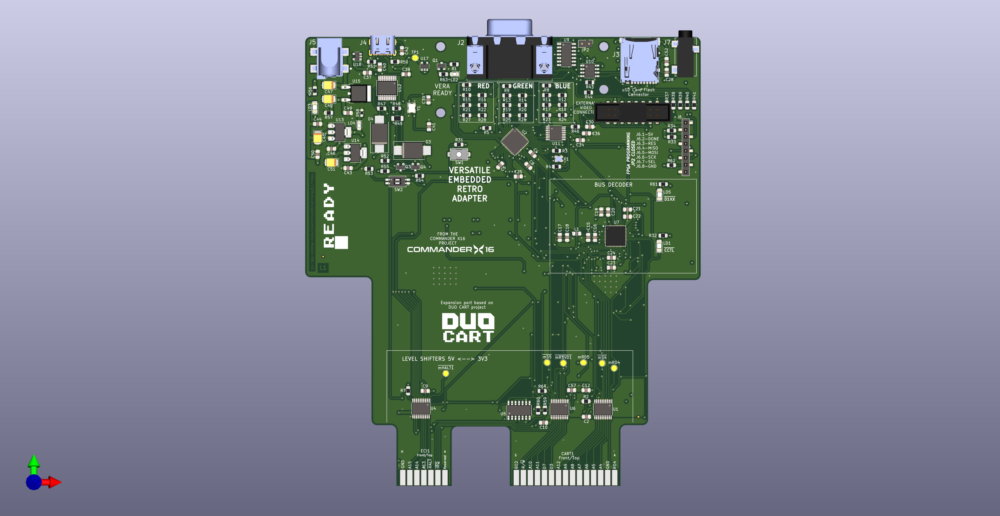
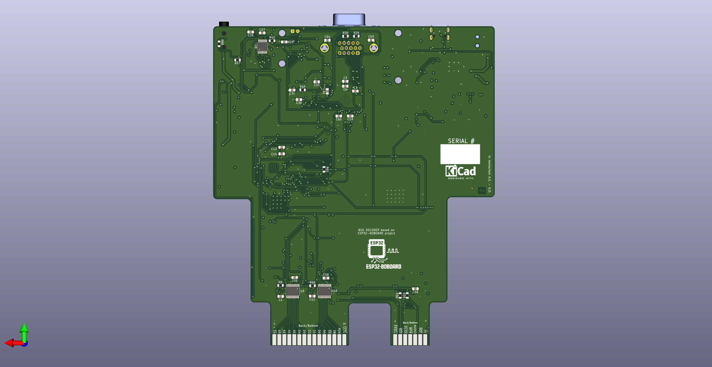

# ▶ VERA Module RBL-XE

<div align="center">

[](https://www.gnu.org/licenses/gpl-3.0)
[](https://www.kicad.org/)
[](https://atari.com)
[](https://www.espressif.com/)

*🌐 English | [🌐 Italiano](#-vera-module-rbl-xe-italiano)*

</div>

---

## ▤ Table of Contents

<details>
<summary>▼ Click to expand navigation</summary>

- [▶ Overview](#-overview)
- [◆ Features](#-features)
- [⚙ Technical Specifications](#-technical-specifications)
- [▣ Hardware Components](#-hardware-components)
- [▦ Board Preview](#-board-preview)
- [▤ PCB Layers](#-pcb-layers)
- [⚡ Connectors & Interfaces](#-connectors--interfaces)
- [⚡ Power Requirements](#-power-requirements)
- [⚙ Assembly Instructions](#-assembly-instructions)
- [▤ Bill of Materials](#-bill-of-materials)
- [⚙ Programming & Configuration](#-programming--configuration)
- [▦ Project Structure](#-project-structure)
- [◉ Contributing](#-contributing)
- [▤ License](#-license)

</details>

---

## ▶ Overview

The **VERA Module RBL-XE** is a sophisticated FPGA-based audio and video expansion card designed specifically for **ATARI XE/XL** computers. This module brings modern graphics and audio capabilities to classic ATARI systems through the **PBI (Parallel Bus Interface)** connector.

<details>
<summary>▼ <strong>What is VERA?</strong></summary>

**VERA** (Video Enhanced Retro Adapter) is originally designed for the Commander X16 computer but has been adapted for ATARI systems. It provides:

- **Advanced Graphics**: Multiple video layers, sprites, and high-resolution modes
- **Enhanced Audio**: Multi-channel digital audio with PCM and PSG capabilities  
- **Modern Connectivity**: VGA output, SD card storage, and USB programming
- **Retro Compatibility**: Seamless integration with classic ATARI software

</details>

---

## ◆ Features

<details>
<summary>▼ <strong>Graphics Capabilities</strong></summary>

### ▶ Video Output
- **VGA Output**: 640x480 @ 60Hz with analog RGB signals
- **Multiple Layers**: Background, foreground, and sprite layers
- **Color Depth**: 256 colors from a palette of 4096
- **Sprites**: Hardware-accelerated sprite engine
- **Scrolling**: Smooth horizontal and vertical scrolling

### ▶ Audio Features
- **Digital Audio**: High-quality PCM audio output
- **Multi-channel**: Stereo audio
- **Audio Codec**: WM8524 for professional audio quality
- **3.5mm Jack**: Standard audio output connector

</details>

<details>
<summary>▼ <strong>System Integration</strong></summary>

### ▶ ATARI Compatibility
- **PBI Interface**: Direct connection to ATARI XE/XL systems
- **Memory Mapping**: $D1XX-$DFXX address space
- **Bus Decoder**: Intelligent address decoding with ESP32
- **Power Management**: Efficient 5V to 3.3V/1.2V conversion

### ▶ Storage & Programming
- **SD Card Slot**: Micro SD for data storage and ROM loading
- **SPI Flash**: 16Mbit W25Q16 for FPGA configuration
- **USB Programming**: CH340 USB-to-serial for easy updates
- **JTAG/SPI**: Direct FPGA programming interface

</details>

---

## ⚙ Technical Specifications

<details>
<summary>▼ <strong>Core Specifications</strong></summary>

| Component | Specification |
|-----------|---------------|
| **FPGA** | Lattice ICE40UP5K-SG48ITR |
| **Microcontroller** | ESP32-PICO-D4 |
| **Flash Memory** | W25Q16JVSNIQ (16Mbit) |
| **Audio Codec** | WM8524CGEDT |
| **USB Interface** | CH340T |
| **Power Regulators** | AMS1117-3.3V, AMS1117-1.2V, L7805 |
| **Crystal Oscillator** | 25MHz ECS-2033-250-BN |
| **PCB Layers** | 4-layer (Signal/Power/GND/Signal) |
| **Board Size** | TBD mm x TBD mm |

</details>

<details>
<summary>▼ <strong>Electrical Characteristics</strong></summary>

| Parameter | Min | Typ | Max | Unit |
|-----------|-----|-----|-----|------|
| **Supply Voltage** | 4.5 | 5.0 | 5.5 | V |
| **Current Consumption** | - | 800 | 1200 | mA |
| **Operating Temperature** | -10 | 25 | 70 | °C |
| **VGA Output Impedance** | - | 75 | - | Ω |
| **Audio Output Level** | - | 2.0 | - | Vrms |

</details>

---

## ▣ Hardware Components

<details>
<summary>▼ <strong>Main Processing Units</strong></summary>

### ▣ FPGA - ICE40UP5K
- **Logic Elements**: 5,280 LUTs
- **Memory**: 120 Kbit BRAM, 1 Mbit SPRAM
- **I/O Pins**: 39 user I/O
- **Package**: QFN-48 (7x7mm)
- **Programming**: SPI configuration

### ▣ ESP32-PICO-D4
- **CPU**: Dual-core Xtensa LX6 @ 240MHz
- **Memory**: 4MB SPI flash, 520KB SRAM
- **Connectivity**: Wi-Fi 802.11 b/g/n, Bluetooth 4.2
- **Package**: QFN-48 (7x7mm)
- **Role**: Bus decoder and system controller

</details>

<details>
<summary>▼ <strong>Interface Components</strong></summary>

### ▶ Audio System
- **Codec**: WM8524CGEDT (24-bit, 192kHz)
- **Interface**: I2S digital audio
- **Output**: 3.5mm stereo jack
- **SNR**: >100dB

### ▶ Video System
- **Output**: 15-pin VGA connector
- **Resolution**: 640x480 @ 60Hz
- **Colors**: 8-bit RGB (256 colors)
- **Sync**: Separate H/V sync signals

</details>

---

## ▦ Board Preview

<details>
<summary>▼ <strong>3D Renderings</strong></summary>

### ▶ Top View

*Top side showing main components and connectors*

### ▶ Bottom View  

*Bottom side with additional components*

### ▶ Cartridge Adapter

*Optional cartridge interface adapter*

</details>

<details>
<summary>▼ <strong>Board Dimensions</strong></summary>

- **Length**: TBD mm
- **Width**: TBD mm  
- **Thickness**: 1.6mm (4-layer PCB)
- **Mounting**: Compatible with ATARI XE/XL PBI slot
- **Connectors**: Right-angle for space efficiency

</details>

---

## ▤ PCB Layers

<details>
<summary>▼ <strong>Layer Stack-up</strong></summary>

### Layer 1 - Top Copper (F.Cu)

*Component placement and signal routing*

### Layer 2 - Power Plane (POWER)

*5V, 3.3V, and 1.2V power distribution*

### Layer 3 - Ground Plane (GND)

*Solid ground plane for signal integrity*

### Layer 4 - Bottom Copper (B.Cu)

*Additional signal routing and components*

</details>

---

## ⚡ Connectors & Interfaces

<details>
<summary>▼ <strong>External Connections</strong></summary>

### ▶ ATARI Interface
- **PBI Connector**: 50-pin edge connector
- **ECI Slot**: Enhanced Cartridge Interface
- **Address Range**: $D1XX-$DFXX
- **Signals**: Data bus, address bus, control signals

### ▶ Video Output (J2)
| Pin | Signal | Description |
|-----|--------|-------------|
| 1-3 | RGB | Red, Green, Blue analog signals |
| 13-14 | H/V Sync | Horizontal/Vertical sync |
| 6-10 | GND | Ground connections |
| 11-12 | Audio L/R | Stereo audio output |

### ▶ Storage Interfaces
- **SD Card Slot (J3)**: Micro SD card interface
- **SPI Flash**: On-board 16Mbit storage
- **USB Port (J4)**: Programming and data transfer

</details>

<details>
<summary>▼ <strong>Programming Interfaces</strong></summary>

### ▶ ICEPROG Connector (J6)
| Pin | Signal | Function |
|-----|--------|----------|
| 1 | 5V | Power supply |
| 2 | GND | Ground |
| 3 | TXD | Serial transmit |
| 4 | RXD | Serial receive |
| 5 | SCK | SPI clock |
| 6 | MISO | SPI data in |
| 7 | MOSI | SPI data out |
| 8 | SS | SPI select |

### ▶ Reset & Control
- **Reset Button (SW1)**: ESP32 system reset
- **DIP Switch (SW2)**: Configuration options
- **Status LEDs**: Power, programming, activity indicators

</details>

---

## ⚡ Power Requirements

<details>
<summary>▼ <strong>Power Distribution</strong></summary>

### ▶ Power Rails
| Rail | Voltage | Current | Components |
|------|---------|---------|------------|
| **5V** | 5.0V ± 5% | 200mA | Input from ATARI, USB |
| **3.3V** | 3.3V ± 3% | 400mA | ESP32, logic, interfaces |
| **1.2V** | 1.2V ± 3% | 300mA | FPGA core voltage |

### ▶ Power Sources
1. **ATARI PBI**: Primary 5V supply from computer
2. **USB**: Alternative 5V for programming/testing
3. **External**: Optional external 5V supply (J5)

### ▶ Power Protection
- **Schottky Diodes**: Reverse polarity protection
- **Ferrite Beads**: EMI filtering
- **Decoupling**: Extensive capacitor network
- **Current Limiting**: Overcurrent protection

</details>

---

## ⚙ Assembly Instructions

<details>
<summary>▼ <strong>Component Assembly</strong></summary>

### ▶ Assembly Order
1. **SMD Components**: Start with smallest components (0603, 0805)
2. **ICs**: Place all integrated circuits
3. **Connectors**: Install all external connectors
4. **Through-hole**: Add any remaining THT components
5. **Testing**: Verify power rails before first power-on

### ▶ Special Considerations
- **FPGA**: Use proper ESD precautions
- **BGA Components**: Requires professional assembly
- **Thermal Management**: Ensure adequate cooling
- **Impedance Control**: Maintain 50Ω for high-speed signals

</details>

<details>
<summary>▼ <strong>Testing & Validation</strong></summary>

### ▶ Power-On Tests
1. **Visual Inspection**: Check for shorts, proper orientation
2. **Power Rails**: Verify all voltages within tolerance
3. **Clock Signals**: Confirm oscillator operation
4. **Communication**: Test SPI, I2C, UART interfaces

### ▶ Functional Tests
1. **FPGA Programming**: Load test bitstream
2. **Video Output**: Verify VGA signal generation
3. **Audio Output**: Test audio codec functionality
4. **ATARI Interface**: Confirm PBI communication

</details>

---

## ▤ Bill of Materials

<details>
<summary>▼ <strong>Component Categories</strong></summary>

### ▣ Major Components
- **1x** ICE40UP5K-SG48ITR FPGA
- **1x** ESP32-PICO-D4 Microcontroller  
- **1x** W25Q16JVSNIQ SPI Flash
- **1x** WM8524CGEDT Audio Codec
- **1x** CH340T USB Interface

### ▣ Passive Components
- **23x** 1µF Capacitors (1206)
- **20x** 100nF Capacitors (1206)
- **6x** 10µF Capacitors (1206)
- **Various** Resistors (0805/1206)
- **1x** 25MHz Crystal Oscillator

### ▣ Connectors
- **1x** 15-pin VGA Connector
- **1x** Micro SD Card Slot
- **1x** USB Type-C Connector
- **1x** 3.5mm Audio Jack
- **1x** 8-pin Programming Header

</details>

<details>
<summary>▼ <strong>Cost Analysis</strong></summary>

| Category | Estimated Cost | Percentage |
|----------|----------------|------------|
| **FPGA** | $15-20 | 35% |
| **ESP32** | $8-12 | 20% |
| **Connectors** | $5-8 | 15% |
| **Passives** | $3-5 | 10% |
| **PCB** | $8-12 | 20% |
| **Total** | **$39-57** | **100%** |

*Costs are estimates for small quantity production*

</details>

---

## ⚙ Programming & Configuration

<details>
<summary>▼ <strong>FPGA Programming</strong></summary>

### ▶ Programming Methods
1. **USB/Serial**: Using CH340 interface with iceprog
2. **SPI Direct**: Direct SPI flash programming
3. **JTAG**: Hardware debugging interface

### ▶ Programming Steps
```bash
# Install icestorm toolchain
sudo apt install fpga-icestorm

# Program FPGA via USB
iceprog vera_module.bin

# Verify programming
iceprog -c
```

### ▶ Development Tools
- **IceStorm**: Open-source FPGA toolchain
- **Yosys**: Verilog synthesis
- **NextPNR**: Place and route
- **KiCad**: PCB design and layout

</details>

<details>
<summary>▼ <strong>ESP32 Configuration</strong></summary>

### ▶ ESP32 Firmware
The ESP32 handles:
- **Bus Decoding**: ATARI address space management
- **Configuration**: FPGA and system setup
- **Communication**: USB, Wi-Fi, Bluetooth interfaces
- **Debugging**: System monitoring and diagnostics

### ▶ Programming ESP32
```bash
# Install ESP-IDF
git clone https://github.com/espressif/esp-idf.git
cd esp-idf && ./install.sh

# Build and flash firmware
idf.py build
idf.py flash
```

</details>

---

## ▦ Project Structure

<details>
<summary>▼ <strong>Repository Organization</strong></summary>

```
Vera-Module-RBL-XE/
├── ▤ README.md                    # This documentation
├── ▤ LICENSE                      # GPL v3 license
├── ⚙ VERA-MODULE-RBL.pro         # KiCad project file
├── ▤ VERA-MODULE-RBL.sch         # Main schematic
├── ▣ VERA-MODULE-RBL.kicad_pcb   # PCB layout
├── ▤ VERA-MODULE-RBL.csv         # Bill of materials
├── ▶ jlcpcb-check-bom.py        # BOM processing script
├── ▦ images/                      # Board images and renders
│   ├── ▦ VERA-MODULE-RBL-TOP.png
│   ├── ▦ VERA-MODULE-RBL-BOTTOM.png
│   ├── ▦ F.Cu-L1.png            # PCB layer images
│   ├── ▦ POWER-L2.png
│   ├── ▦ GND-L3.png
│   └── ▦ B.Cu-L4.png
├── ▦ production/                  # Manufacturing files
│   ├── ▤ *.gbl, *.gtl            # Gerber files
│   ├── ▤ *.drl                   # Drill files
│   └── ▤ *.gbrjob                # Job files
├── ▦ ibom/                       # Interactive BOM
│   └── ▶ ibom.html
└── ▦ schematics/                 # Individual schematics
    ├── ▤ vera-fpga.sch           # FPGA module
    ├── ▤ busdecoder.sch          # Bus decoder
    ├── ▤ cartridgeInterface.sch   # Cartridge interface
    ├── ▤ vera-fpga-flash.sch     # Flash memory
    └── ▤ powersupply.sch         # Power management
```

</details>

<details>
<summary>▼ <strong>Design Files</strong></summary>

### ▶ KiCad Files
- **Schematic**: Multi-sheet hierarchical design
- **PCB Layout**: 4-layer board with controlled impedance
- **3D Models**: Custom component models
- **Footprints**: Custom connector footprints

### ▶ Manufacturing Files
- **Gerber Files**: Industry-standard PCB fabrication
- **Drill Files**: NC drill and via specifications  
- **Pick & Place**: SMT assembly coordinates
- **BOM**: Component specifications with LCSC part numbers

</details>

---

## ◉ Contributing

<details>
<summary>▼ <strong>Development Guidelines</strong></summary>

### ▶ Contributing Process
1. **Fork** the repository
2. **Create** a feature branch
3. **Make** your changes
4. **Test** thoroughly
5. **Submit** a pull request

### ▶ Contribution Areas
- **Hardware Design**: PCB layout improvements
- **Firmware**: ESP32 and FPGA code
- **Documentation**: User guides and tutorials
- **Testing**: Validation and verification
- **Software**: Host applications and tools

### ▶ Design Goals
- **Compatibility**: Maintain ATARI XE/XL compatibility
- **Performance**: Optimize for speed and efficiency
- **Reliability**: Ensure robust operation
- **Manufacturability**: Design for production
- **Cost**: Balance features with affordability

</details>

---

## ▤ License

This project is licensed under the **GNU General Public License v3.0**.

<details>
<summary>▼ <strong>License Details</strong></summary>

### ▶ Permissions
- ◉ Commercial use
- ◉ Modification
- ◉ Distribution
- ◉ Patent use
- ◉ Private use

### ▶ Limitations
- ◯ Liability
- ◯ Warranty

### ▶ Conditions
- ▤ License and copyright notice
- ▤ State changes
- ▤ Disclose source
- ▤ Same license

For the complete license text, see the [LICENSE](LICENSE) file.

</details>

---

<div align="center">

## ◆ Support the Project

If you find this project useful, please consider:

◆ **Starring** the repository  
◉ **Reporting** issues  
⚙ **Contributing** improvements  
▶ **Sharing** with the community  

---

**Made with ◉ by RetroBit Lab**

*Bringing modern capabilities to classic computers*

</div>

---

# ▶ VERA Module RBL-XE (Italiano)

<div align="center">

*[🌐 English](#-vera-module-rbl-xe) | 🌐 Italiano*

</div>

---

## ▤ Indice

<details>
<summary>▼ Clicca per espandere la navigazione</summary>

- [▶ Panoramica](#-panoramica)
- [◆ Caratteristiche](#-caratteristiche)
- [⚙ Specifiche Tecniche](#-specifiche-tecniche)
- [▣ Componenti Hardware](#-componenti-hardware)
- [▦ Anteprima Scheda](#-anteprima-scheda)
- [▤ Layer PCB](#-layer-pcb)
- [⚡ Connettori e Interfacce](#-connettori-e-interfacce)
- [⚡ Requisiti di Alimentazione](#-requisiti-di-alimentazione)
- [⚙ Istruzioni di Assemblaggio](#-istruzioni-di-assemblaggio)
- [▤ Distinta Materiali](#-distinta-materiali)
- [⚙ Programmazione e Configurazione](#-programmazione-e-configurazione)
- [▦ Struttura Progetto](#-struttura-progetto)
- [◉ Contribuire](#-contribuire)
- [▤ Licenza](#-licenza-1)

</details>

---

## ▶ Panoramica

Il **VERA Module RBL-XE** è una sofisticata scheda di espansione audio e video basata su FPGA, progettata specificamente per i computer **ATARI XE/XL**. Questo modulo porta capacità grafiche e audio moderne ai sistemi ATARI classici attraverso il connettore **PBI (Parallel Bus Interface)**.

<details>
<summary>▼ <strong>Cos'è VERA?</strong></summary>

**VERA** (Video Enhanced Retro Adapter) è originariamente progettato per il computer Commander X16 ma è stato adattato per i sistemi ATARI. Fornisce:

- **Grafica Avanzata**: Livelli video multipli, sprite e modalità ad alta risoluzione
- **Audio Migliorato**: Audio digitale multicanale con capacità PCM e PSG
- **Connettività Moderna**: Uscita VGA, storage su scheda SD e programmazione USB
- **Compatibilità Retro**: Integrazione perfetta con il software ATARI classico

</details>

---

## ◆ Caratteristiche

<details>
<summary>▼ <strong>Capacità Grafi▼che</strong></summary>

### ▶ Uscita Video
- **Uscita VGA**: 640x480 @ 60Hz con segnali RGB analogici
- **Livelli Multipli**: Livelli di sfondo, primo piano e sprite
- **Profondità Colore**: 256 colori da una palette di 4096
- **Sprite**: Motore sprite accelerato hardware
- **Scrolling**: Scorrimento orizzontale e verticale fluido

### ▶ Caratteristiche Audio
- **Audio Digitale**: Uscita audio PCM di alta qualità
- **Multicanale**: Audio stereo
- **Codec Audio**: WM8524 per qualità audio professionale
- **Jack 3.5mm**: Connettore uscita audio standard

</details>

<details>
<summary>▼ <strong>Integrazione Sistema</strong></summary>

### ▶ Compatibilità ATARI
- **Interfaccia PBI**: Connessione diretta ai sistemi ATARI XE/XL
- **Mappatura Memoria**: Spazio indirizzi $D1XX-$DFXX
- **Decodificatore Bus**: Decodifica indirizzi intelligente con ESP32
- **Gestione Alimentazione**: Conversione efficiente da 5V a 3.3V/1.2V

### ▶ Storage e Programmazione
- **Slot Scheda SD**: Micro SD per storage dati e caricamento ROM
- **Flash SPI**: 16Mbit W25Q16 per configurazione FPGA
- **Programmazione USB**: CH340 USB-to-serial per aggiornamenti facili
- **JTAG/SPI**: Interfaccia programmazione FPGA diretta

</details>

---

## ⚙ Specifiche Tecniche

<details>
<summary>▼ <strong>Specifiche Principali</strong></summary>

| Componente | Specifica |
|------------|-----------|
| **FPGA** | Lattice ICE40UP5K-SG48ITR |
| **Microcontrollore** | ESP32-PICO-D4 |
| **Memoria Flash** | W25Q16JVSNIQ (16Mbit) |
| **Codec Audio** | WM8524CGEDT |
| **Interfaccia USB** | CH340T |
| **Regolatori Alimentazione** | AMS1117-3.3V, AMS1117-1.2V, L7805 |
| **Oscillatore Cristallo** | 25MHz ECS-2033-250-BN |
| **Layer PCB** | 4 layer (Segnale/Alimentazione/GND/Segnale) |
| **Dimensioni Scheda** | TBD mm x TBD mm |

</details>

<details>
<summary>▼ <strong>Caratteristiche Elettriche</strong></summary>

| Parametro | Min | Tip | Max | Unità |
|-----------|-----|-----|-----|-------|
| **Tensione Alimentazione** | 4.5 | 5.0 | 5.5 | V |
| **Consumo Corrente** | - | 800 | 1200 | mA |
| **Temperatura Operativa** | -10 | 25 | 70 | °C |
| **Impedenza Uscita VGA** | - | 75 | - | Ω |
| **Livello Uscita Audio** | - | 2.0 | - | Vrms |

</details>

---

## ▣ Componenti Hardware

<details>
<summary>▼ <strong>Unità di Elaborazione Principali</strong></summary>

### ▣ FPGA - ICE40UP5K
- **Elementi Logici**: 5,280 LUT
- **Memoria**: 120 Kbit BRAM, 1 Mbit SPRAM
- **Pin I/O**: 39 I/O utente
- **Package**: QFN-48 (7x7mm)
- **Programmazione**: Configurazione SPI

### ▣ ESP32-PICO-D4
- **CPU**: Dual-core Xtensa LX6 @ 240MHz
- **Memoria**: 4MB flash SPI, 520KB SRAM
- **Connettività**: Wi-Fi 802.11 b/g/n, Bluetooth 4.2
- **Package**: QFN-48 (7x7mm)
- **Ruolo**: Decodificatore bus e controllore sistema

</details>

<details>
<summary>▼ <strong>Componenti Interfaccia</strong></summary>

### ▶ Sistema Audio
- **Codec**: WM8524CGEDT (24-bit, 192kHz)
- **Interfaccia**: Audio digitale I2S
- **Uscita**: Jack stereo 3.5mm
- **SNR**: >100dB

### ▶ Sistema Video
- **Uscita**: Connettore VGA 15-pin
- **Risoluzione**: 640x480 @ 60Hz
- **Colori**: RGB 8-bit (256 colori)
- **Sync**: Segnali H/V sync separati

</details>

---

## ▦ Anteprima Scheda

<details>
<summary>▼ <strong>Rendering 3D</strong></summary>

### ▶ Vista Superiore

*Lato superiore mostrando componenti principali e connettori*

### ▶ Vista Inferiore

*Lato inferiore con componenti aggiuntivi*

### ▶ Adattatore Cartuccia

*Adattatore interfaccia cartuccia opzionale*

</details>

---

## ▤ Layer PCB

<details>
<summary>▼ <strong>Stack-up Layer</strong></summary>

### Layer 1 - Rame Superiore (F.Cu)

*Posizionamento componenti e routing segnali*

### Layer 2 - Piano Alimentazione (POWER)

*Distribuzione alimentazione 5V, 3.3V e 1.2V*

### Layer 3 - Piano Massa (GND)

*Piano massa solido per integrità segnale*

### Layer 4 - Rame Inferiore (B.Cu)

*Routing segnali aggiuntivo e componenti*

</details>

---

## ⚡ Connettori e Interfacce

<details>
<summary>▼ <strong>Connessioni Esterne</strong></summary>

### ▶ Interfaccia ATARI
- **Connettore PBI**: Connettore edge 50-pin
- **Slot ECI**: Enhanced Cartridge Interface
- **Range Indirizzi**: $D1XX-$DFXX
- **Segnali**: Bus dati, bus indirizzi, segnali controllo

### ▶ Uscita Video (J2)
| Pin | Segnale | Descrizione |
|-----|---------|-------------|
| 1-3 | RGB | Segnali analogici Rosso, Verde, Blu |
| 13-14 | H/V Sync | Sync orizzontale/verticale |
| 6-10 | GND | Connessioni massa |
| 11-12 | Audio L/R | Uscita audio stereo |

### ▶ Interfacce Storage
- **Slot Scheda SD (J3)**: Interfaccia scheda Micro SD
- **Flash SPI**: Storage on-board 16Mbit
- **Porta USB (J4)**: Programmazione e trasferimento dati

</details>

---

## ⚡ Requisiti di Alimentazione

<details>
<summary>▼ <strong>Distribuzione Alimentazione</strong></summary>

### ▶ Rail Alimentazione
| Rail | Tensione | Corrente | Componenti |
|------|----------|----------|------------|
| **5V** | 5.0V ± 5% | 200mA | Ingresso da ATARI, USB |
| **3.3V** | 3.3V ± 3% | 400mA | ESP32, logica, interfacce |
| **1.2V** | 1.2V ± 3% | 300mA | Tensione core FPGA |

### ▶ Sorgenti Alimentazione
1. **PBI ATARI**: Alimentazione 5V primaria dal computer
2. **USB**: 5V alternativo per programmazione/test
3. **Esterno**: Alimentazione 5V esterna opzionale (J5)

</details>

---

## ⚙ Istruzioni di Assemblaggio

<details>
<summary>▼ <strong>Assemblaggio Componenti</strong></summary>

### ▶ Ordine Assemblaggio
1. **Componenti SMD**: Iniziare con componenti più piccoli (0603, 0805)
2. **IC**: Posizionare tutti i circuiti integrati
3. **Connettori**: Installare tutti i connettori esterni
4. **Through-hole**: Aggiungere eventuali componenti THT rimanenti
5. **Test**: Verificare rail alimentazione prima della prima accensione

### ▶ Considerazioni Speciali
- **FPGA**: Usare precauzioni ESD appropriate
- **Componenti BGA**: Richiede assemblaggio professionale
- **Gestione Termica**: Assicurare raffreddamento adeguato
- **Controllo Impedenza**: Mantenere 50Ω per segnali alta velocità

</details>

---

## ▤ Distinta Materiali

<details>
<summary>▼ <strong>Categorie Componenti</strong></summary>

### ▣ Componenti Principali
- **1x** ICE40UP5K-SG48ITR FPGA
- **1x** ESP32-PICO-D4 Microcontrollore
- **1x** W25Q16JVSNIQ Flash SPI
- **1x** WM8524CGEDT Codec Audio
- **1x** CH340T Interfaccia USB

### ▣ Componenti Passivi
- **23x** Condensatori 1µF (1206)
- **20x** Condensatori 100nF (1206)
- **6x** Condensatori 10µF (1206)
- **Vari** Resistori (0805/1206)
- **1x** Oscillatore Cristallo 25MHz

### ▣ Connettori
- **1x** Connettore VGA 15-pin
- **1x** Slot Scheda Micro SD
- **1x** Connettore USB Type-C
- **1x** Jack Audio 3.5mm
- **1x** Header Programmazione 8-pin

</details>

---

## ⚙ Programmazione e Configurazione

<details>
<summary>▼ <strong>Programmazione FPGA</strong></summary>

### ▶ Metodi Programmazione
1. **USB/Seriale**: Usando interfaccia CH340 con iceprog
2. **SPI Diretto**: Programmazione flash SPI diretta
3. **JTAG**: Interfaccia debug hardware

### ▶ Passi Programmazione
```bash
# Installare toolchain icestorm
sudo apt install fpga-icestorm

# Programmare FPGA via USB
iceprog vera_module.bin

# Verificare programmazione
iceprog -c
```

</details>

---

## ▦ Struttura Progetto

<details>
<summary>▼ <strong>Organizzazione Repository</strong></summary>

```
Vera-Module-RBL-XE/
├── ▤ README.md                    # Questa documentazione
├── ▤ LICENSE                      # Licenza GPL v3
├── ⚙ VERA-MODULE-RBL.pro         # File progetto KiCad
├── ▤ VERA-MODULE-RBL.sch         # Schema principale
├── ▣ VERA-MODULE-RBL.kicad_pcb   # Layout PCB
├── ▤ VERA-MODULE-RBL.csv         # Distinta materiali
├── ▶ jlcpcb-check-bom.py        # Script elaborazione BOM
├── ▦ images/                      # Immagini scheda e render
├── ▦ production/                  # File produzione
├── ▦ ibom/                       # BOM interattiva
└── ▦ schematics/                 # Schemi individuali
```

</details>

---

## ◉ Contribuire

<details>
<summary>▼ <strong>Linee Guida Sviluppo</strong></summary>

### ▶ Processo Contribuzione
1. **Fork** del repository
2. **Creare** un branch feature
3. **Apportare** le modifiche
4. **Testare** accuratamente
5. **Inviare** una pull request

### ▶ Aree Contribuzione
- **Design Hardware**: Miglioramenti layout PCB
- **Firmware**: Codice ESP32 e FPGA
- **Documentazione**: Guide utente e tutorial
- **Test**: Validazione e verifica
- **Software**: Applicazioni host e strumenti

</details>

---

## ▤ Licenza

Questo progetto è licenziato sotto la **GNU General Public License v3.0**.

Per il testo completo della licenza, vedere il file [LICENSE](LICENSE).

---

<div align="center">

## ◆ Supporta il Progetto

Se trovi utile questo progetto, considera di:

◆ **Mettere una stella** al repository  
◉ **Segnalare** problemi  
⚙ **Contribuire** miglioramenti  
▶ **Condividere** con la community  

---

**Realizzato con ◉ da RetroBit Lab**

*Portando capacità moderne ai computer classici*

</div>
